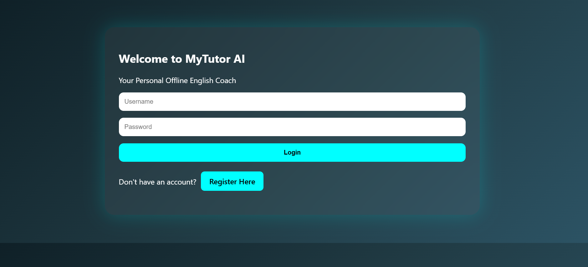
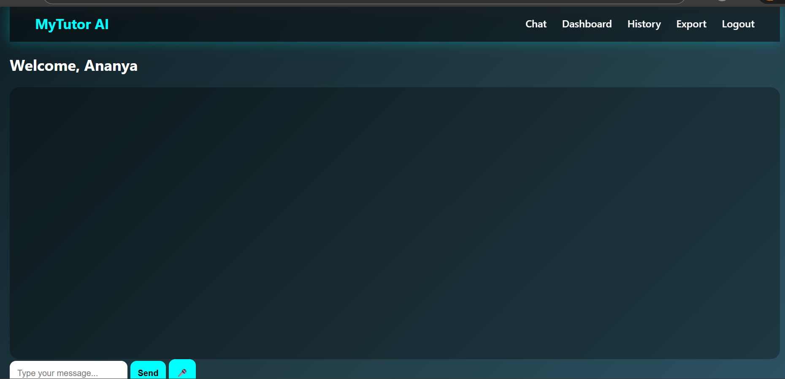
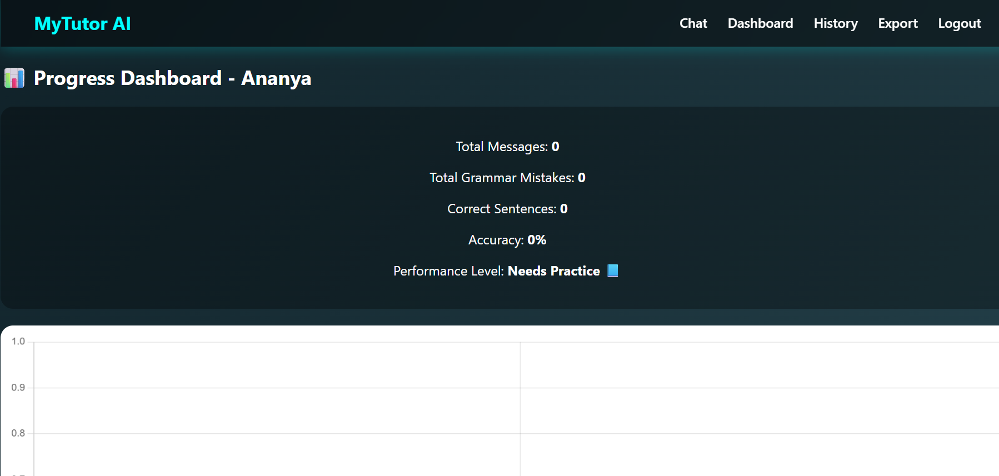

# MyTutor AI 

Offline AI-Based English Learning Assistant with Performance Analytics

---

## 📌 Project Overview

MyTutor AI is a fully offline AI-powered English learning assistant that helps users improve grammar, practice communication, and track performance using analytics dashboards.

This system integrates a local Large Language Model (Ollama + Mistral) with a Flask web application.

---

## 🚀 Features

- 🧠 Offline AI (No Internet Required)
- ✍️ Grammar Correction with Explanation
- 🎤 Voice Input & Output
- 🔐 User Registration & Login
- 📊 Performance Dashboard
- 📈 Accuracy & Daily Progress Tracking
- 🗂 Chat History Storage
- 📤 Export Chat History
- 🔄 Reset Progress
- 💻 Modern Professional UI

---

## 🛠 Tech Stack

- Python
- Flask
- SQLite
- Ollama (Mistral Model)
- HTML / CSS / JavaScript
- Chart.js

---

## 📸 Screenshots

### 🔐 Login Page

### 💬 Chat Interface

### 📊 Dashboard

---

## 🧠 Architecture

User → Flask Backend → Ollama LLM → Response  
        ↓  
     SQLite Database  

---

## ⚙️ How to Run

1. Install Ollama
2. Pull model:
